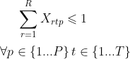
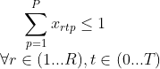
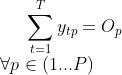

# ACL_Project_2

ist1101360 - Jérémy Breton

ist1101618 - Marc Traverso

## How does it work?

Variables: X__R_T_P, A__R_T and Y__TC_P

- The variable X is the task for a runner "R" at the position "P" at time "T".

- The variable A is the activity of a runner "R" at time "T". If he is active or not.

- The variable Y represents when a product P arrives at the packaging area at time TC (TC=T+C, time when it's placed on the conveyor + time to arrives).

---

## Importants aspects of this project:

    - (1): We have to make sure that two runners are not at the same position at time t.
  
    - (2): We also have to check that a runner doesn't have a task between two tasks. If he is running from position p at time t to position q, he can't be at any position between t and t+t_pq.
    
    - (3): If a runner is at position p he can't be at position q at the same time t.
    
    - (4): We have to make sure that every runners stay active without taking any pauses. It means that a runner must move to another position or he becomes inactive.
    
    - (5): If we have a runner inactive at time t it implies that he is inactive at t+1.
    
    - (6): All runners must have a timespan of at least 50% of the maximum. So, for a runner active at time t, all others runners must be active at t/2.
    
    - (7): We have to check that a runner was at position p at time t-c_p when a product p arrives at the packaging area at time t.
    
    - (8): All products must arrive at the packaging area.

## Clauses:

### (1): 

---

### (2): 

---

### (3):

---

### (4):

---

### (5):

---

### (6):

---

### (7):

---

### (8):

